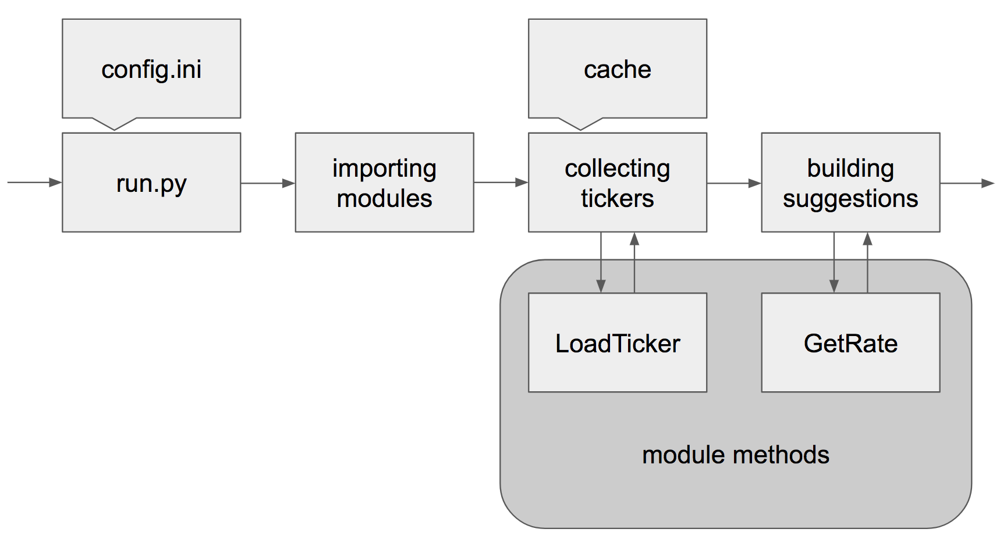

# Stock differences suggester

## Project

The task is to scan markets and find huge prices differences which can be closed instantly for some revenue.
Each run downloads tickers (if necessary), compares prices and suggests a serie of transactions.

## Usage

It's expected to be run as many times as necessary. Execute *run.py* (python3 is required).
You may choose some params flexible by changing config file *config.ini*.

## Config

[Config file](./config.ini) contains of several sections: markets, coins, update and suggestions.
* `[markets]` section describes available exchange markets to collect information;
* `[coins]` is about coins you already have and you're interested in increasing their quantity;
* `[update]` describes period in time (per seconds) for refreshing ticker on each market;
* `[suggestions]` section has a serie of thresholds about when the difference is huge enough to perform exchanges.

## System

A whole system can be represented as following:

### Modules

All modules should be located at `./markets` directory. It's mandatory that each module should has the following methods:
* `%moduleName%LoadTicker` is a single-executing query which uses market API, downloads and returns a ticker in any inner format;
* `%moduleName%GetRate` should accept its ticker and two coin abbreviations to return their exchange rate; it may be executed many times.

New modules can be included easily. Make sure your module has these two necessary methods, then add a module name to a `[markets]` session in the config file.

### Cache

For avoiding being banned, it's important to not flood market API. The system uses simple caching that is storing downloaded tickers in `./data` directory.
Each file in `./data` directory is a [JSON](./data/empty) with two fields: time when a ticker was downloaded and a ticker representation itself.
The system tries to load a ticker from a file for corresponding market; if the file exists it's important to check how fresh the data inside.
An `[update]` section in the [config file](./config.ini) contains of TTL of each ticker.

## Execution

For now, all the executing process steps are printed into stdout. All suggestion also printed into stdout as well in user-friendly format.
